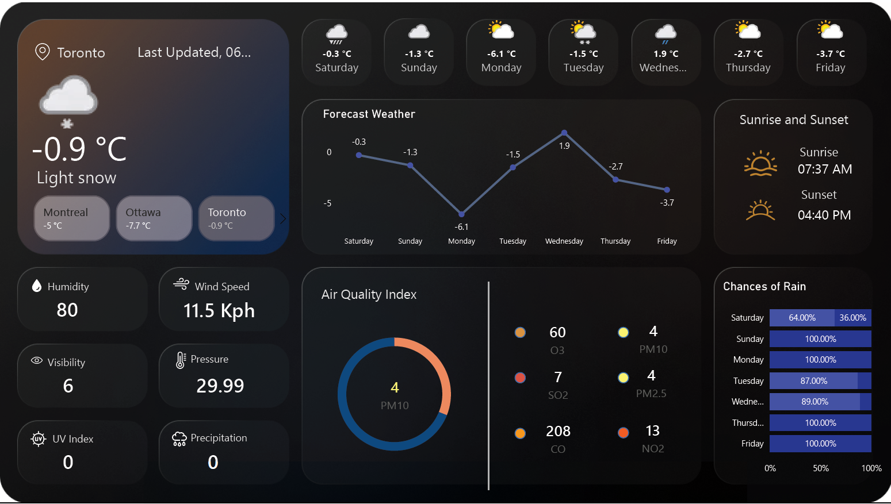

# Power BI Weather Dashboard

This project is a dynamic **weather dashboard** built in Power BI. It allows users to view current and forecasted weather conditions for selected cities, including temperature trends, sunrise and sunset times, rain probability, and air quality indices (AQI) with interactive indicators.

---

## Features

### Forecast Temperature Visualization
- Line chart showing **average daily temperature**.  
- **Interactive slicer** to select dates or days of the week.  
- Custom styling with **theme-based colors and markers**.  

### Sunrise and Sunset Times
- Displays formatted **sunrise and sunset times**.  
- Includes **icons** for visual representation.  
- **Dynamic placement** for better readability.  

### Rain Probability
- Gauge chart showing the **chance of rain** as a percentage.  
- Automatically calculates remaining value: `100% - chance of rain`.  
- Custom styling with **transparent fill and colored borders**.  

### Air Quality Index (AQI) Indicators
- KPIs for pollutants like **PM10, CO, and OC**.  
- **Conditional formatting:** indicators change color based on severity.  
- Custom measures to calculate **high-alert thresholds**.  

### Dynamic Suggestions and Status
- Measures provide **user-friendly suggestions** based on AQI.  
- Status text dynamically updates with **conditional formatting**.  

### Auto-refresh Functionality
- The dashboard can **refresh automatically** with the latest data in Power BI Service.  
- Ensures **correct weather data** is displayed for any city in real-time.  

---

## Data Sources

- **Forecast Data Table:**  
  Contains columns like Date, Temperature, Sunrise, Sunset, Chance of Rain, and AQI metrics.

- **Current Weather Data Table:**  
  Optional for showing live data such as CO, PM10, OC values.

- **Custom Measures:**  
  Created for calculating averages, remaining rain probability, and conditional color formatting.

---

## Setup Instructions

### 1. Load Data
- Import your **forecast** and **current weather** data into Power BI.

### 2. Create Calculated Columns
- **Sunrise & Sunset:** Extract hours, minutes, and AM/PM using the `FORMAT` function.  
- **Left Value for Rain Gauge:** `100 - [Chance of Rain]`.

### 3. Build Visuals

**Temperature Line Chart**  
- Use **average temperature** as the value.  
- Apply **theme-based colors**, enable markers, and format axes.

**Sunrise & Sunset Cards**  
- Insert **cards**, apply **icons**, format **text size**, and position properly.

**Rain Gauge**  
- Use **major measure** for conditional styling.  
- Adjust **border thickness** and transparency.

**AQI Indicators**  
- Create measures for **PM10, CO, OC**, etc.  
- Apply **conditional formatting** with color measures.  
- Remove unnecessary decimals for cleaner display.

**Dynamic Suggestion Text**  
- Use measures to display **recommendations** based on AQI values.

### 4. Styling & Formatting
- Apply consistent **theme colors** (orange for primary data, white for text/axes).  
- Adjust **gridlines, marker visibility, font size, and spacing** for readability.

### 5. Set Up Auto-refresh (Optional)
- Publish the dashboard to **Power BI Service**.  
- Enable **scheduled refresh** to update data automatically.

---

## Author
[Katrina Panwar](https://github.com/YourGitHubUsername)

